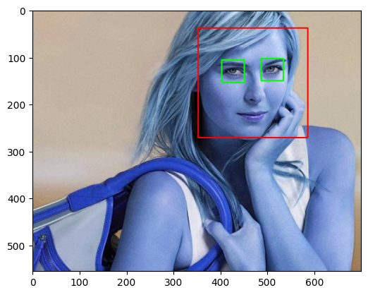
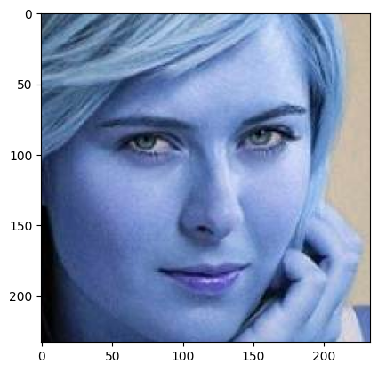
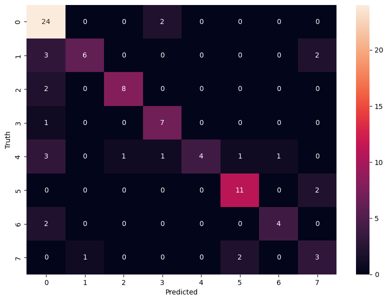

---

# Facial Recognition System

## Overview

The Celebrity Face Recognition system is designed to accurately identify celebrities from a set of images. It leverages powerful image processing techniques to detect facial features and machine learning algorithms to classify the images. The project demonstrates a complete pipeline from image preprocessing to model training and evaluation, providing a robust solution for face recognition tasks.

## Features

- **Face and Eye Detection**: Utilizes Haar cascades to accurately detect faces and eyes in images.
- **Image Cropping**: Extracts facial regions from the detected faces for focused analysis.
- **Wavelet Transformation**: Applies wavelet transformation to enhance feature extraction by capturing both spatial and frequency information.
- **SVM Classifier**: Trains a Support Vector Machine (SVM) classifier using a combination of raw and transformed image data.
- **Hyperparameter Tuning**: Employs GridSearchCV for fine-tuning model parameters to achieve optimal performance.
- **Evaluation Metrics**: Provides detailed evaluation through classification reports and confusion matrices.
- **Model Persistence**: Saves the trained model and class dictionary for future use.

## Dataset

The dataset consists of images of various celebrities, organized in different directories where each directory corresponds to a particular celebrity. The images undergo preprocessing steps to detect and crop facial regions. Only images with at least two detected eyes are used for training to ensure data quality.

## Key Functions

### Preprocessing
- **Face Detection**: Detect faces and eyes in images using Haar cascades.
- **Image Cropping**: Crop the facial regions based on detected coordinates.
- **Wavelet Transformation**: Apply wavelet transformation to the cropped images to extract enhanced features.

### Model Training
- **Feature Extraction**: Combine raw pixel data and wavelet-transformed data to create a comprehensive feature set.
- **Training**: Train an SVM classifier using the extracted features.
- **Hyperparameter Tuning**: Use GridSearchCV to try different models and fine-tune their parameters for the best performance.

### Evaluation
- **Model Evaluation**: Assess the classifier's performance using classification reports and confusion matrices.
- **Visualization**: Visualize evaluation results through confusion matrices and other relevant plots.

## Preprocessing steps

### Face and Eye Detection

### Cropped Facial Region

### Wavelet Transformed Image

### Confusion Matrix

### Predicted Output Example

Here is an example of an image processed by the model along with its predicted celebrity name:

**Predicted Celebrity**: Serena Williams
---

